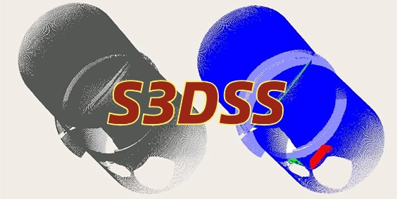
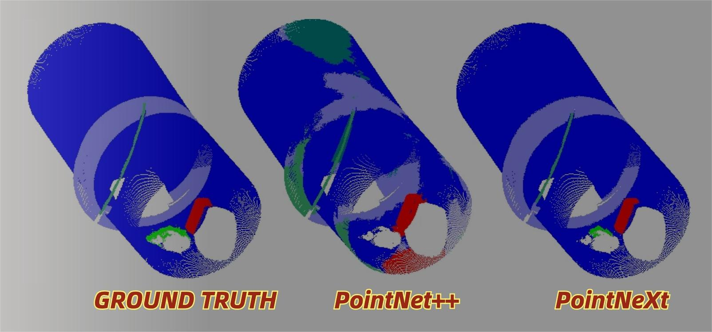

# S3DSS-PointNeXt

## Welcome to DUT Sewer3D Semantic Segmentation Dataset! | [[S3DSS Dataset Download Address]](url) | [[OpenPoints Library]](https://github.com/guochengqian/openpoints) | [[PointNeXt Online Documentation]](https://guochengqian.github.io/PointNeXt/)

<p align="center">

</p>

---

## Motivation and Background
Urban sewer pipelines, as the critical guarantors of urban resilience and sustainable development, undertake the task of sewage disposal and flood prevention. However, in many countries, most municipal sewer systems have been in service for *60* to *100* years, with the *worst* condition rating (*D+*) evaluated by ASCE.
As laser scanning is fast becoming the state-of-the-art inspection technique for underground sewers, semantic segmentation of pipeline point clouds is an essential intermediate step for pipeline condition assessment and digital twinning. Currently, similar to other building structures, the scarcity of real-world point clouds has hindered the application of deep learning techniques for automated sewer pipeline semantic segmentation.

---

## Goal
We provided a high-quality, realistic, semantically-rich public dataset named "*Sewer3D Semantic Segmentation*" (*S3DSS*), including *2500* synthetic scans and *500* real-world scans, for point cloud semantic segmentation in the sewer pipeline domain, for which there are no public datasets in the past. S3DSS contains *230 million points* with *8* categories of common sewer defects. We hope it can be a starting point for benchmarking developed approaches to promote deep learning research on the point cloud of sewer pipeline defects.

<p align="center">

</p>

---

## Content and Annotations
The two sub-datasets were obtained in the following way. The real point cloud data were captured in laboratory scenarios using a **FARO Focus S laser scanner**. We used two prototype **reinforced concrete sewer pipes** to create most of the defect scenes. However, for misalign and displace defects that are difficult to operate with concrete pipes, we used two **steel pipes** which were well-designed to simulate. A total of 500 real scans were collected.

The synthetic point cloud data were obtained by our automated synthetic data generator in Unity3D. [The introduction to the synthetic point cloud data generation methodology can be found in our paper.](url) We generated 2500 scans of sewer defect scenes. In S3DSS, 8 common defect classes are used which includes:

-  Normal
-  Spalling
-  Blockage
-  Corrosion
-  Misalign
-  Deposit
-  Displace
-  Rubber Ring

<p align="center">


</p>

For more details you can go to [our website](url).

## PointNeXt Installation
First you need to download and add the toolkit [OpenPoints Library](https://github.com/guochengqian/openpoints)

A simple bash file to install the environment:

```
git clone --recurse-submodules git@github.com:guochengqian/PointNeXt.git
cd PointNeXt
source update.sh
source install.sh
```
Cuda-11.3 is required. Modify the `install.sh` if a different cuda version is used. See [Install](docs/index.md) for detail. 


## Usage 
Check our [online documentation](https://guochengqian.github.io/PointNeXt/) for detailed instructions. 

A short instruction: all experiments follow the simple rule to train and test: 

```
CUDA_VISIBLE_DEVICES=$GPUs python examples/$task_folder/main.py --cfg $cfg $kwargs
```
- $GPUs is the list of GPUs to use, for most experiments (ScanObjectNN, ModelNet40, S3DIS), we only use 1 A100 (GPUs=0)
- $task_folder is the folder name of the experiment. For example, for s3dis segmentation, $task_folder=s3dis
- $cfg is the path to cfg, for example, s3dis segmentation, $cfg=cfgs/s3dis/pointnext-s.yaml
- $kwargs are the other keyword arguments to use. For example, testing in S3DIS area 5, $kwargs should be `mode=test, --pretrained_path $pretrained_path`. 

## Read S3DSS Dataset


